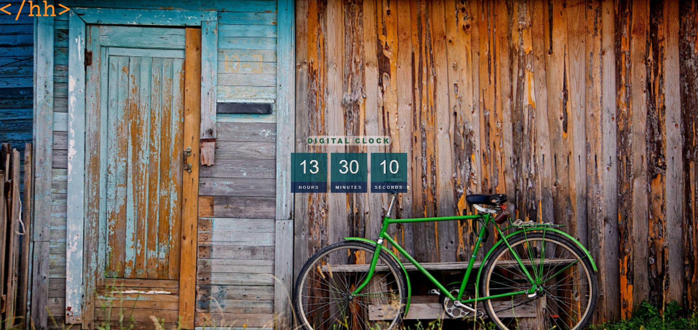

# Digital Clock

A simple JavaScript project built independently to practice DOM manipulation, working with the Date object.

## Technologies

- HTML

- CSS

- JavaScript

- SVG

## Features

- Real-time digital clock display (hours, minutes, seconds)

- Centered layout using Flexbox

- Fullscreen background image integration

- Styled UI elements using CSS opacity and custom layout

- Custom SVG logo branding

## Screenshots

Index

