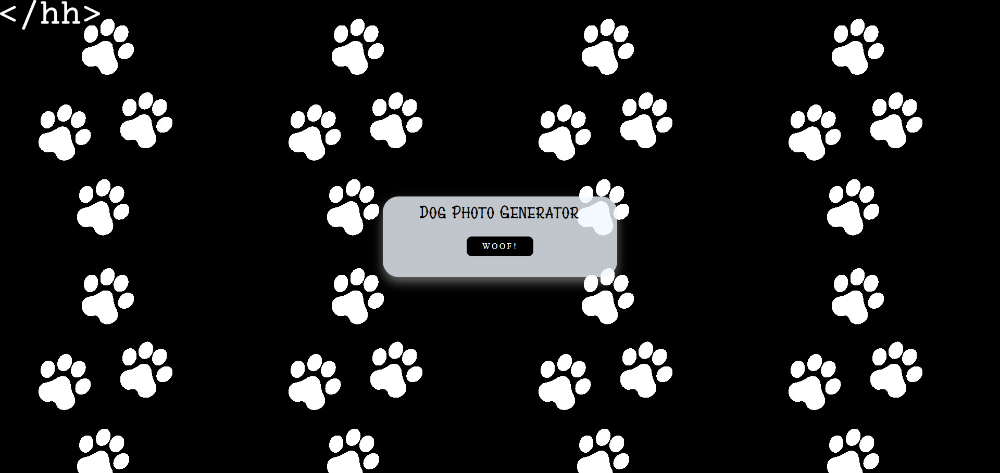
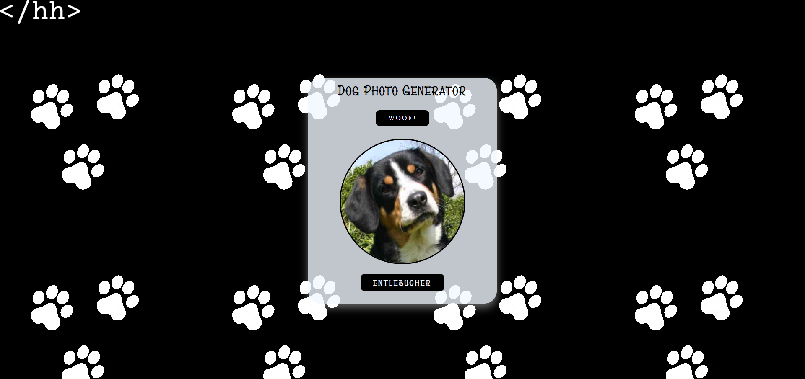

# Random Dog Photo

A simple JavaScript project built independently to practice DOM manipulation, working with API.

## Technologies

- HTML

- CSS

- JavaScript

- SVG

## Features

- Random image API (dog photos)

- Centered layout using Flexbox

- Custom SVG loading

## Screenshots

Index

After

